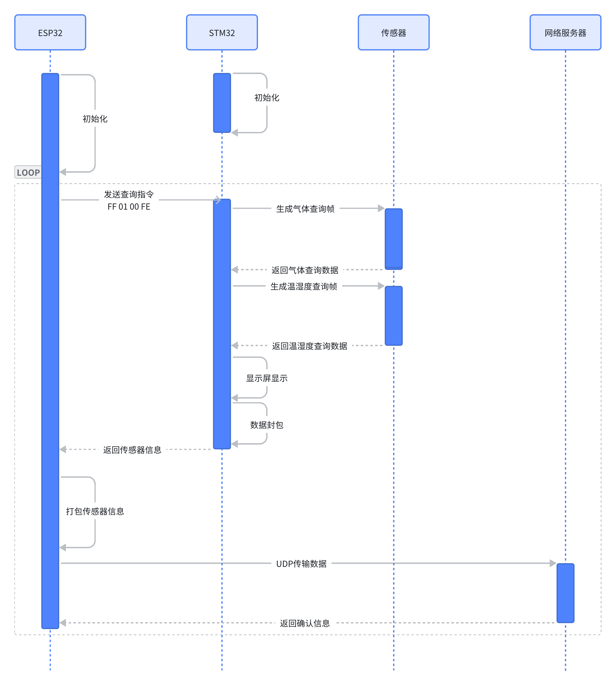

# 项目简介

该项目能够检测工厂中四种常见气体（氧气、一氧化碳、硫化氢、甲烷），同时检测温度和湿度并显示在7寸屏幕上，并且能够将所获得的传感器数据上传至指定服务器。

# 开发环境

## 开发工具

|  | STM32 | ESP32 |
| --- | --- | --- |
| 操作系统 | Windows10 | Ubuntu 18.04 |
| CPU | Intel Core i7-11800H | Intel Core i7-11800H |
| Mem | DDR4 16G*2 | DDR4 16G*2 |
| Hard Disk | 512G SSD | 512G SSD |
| 开发平台 | MDK5.28 | ESP-IDF |

## 所需硬件

| 芯片 | STM32F429ZGT6 |
| --- | --- |
|  | ESP32-WROOM-32 |
| 传感器 | 四合一气体传感器 |
|  | DHT11温湿度传感器 |
| 显示 | 7寸可触摸LCD RGB888屏幕 |

# 系统示意图

# 硬件接线

| 野火 5 / 7寸电容屏模块 |  |  |  | 野火F429开发板V1 |
| --- | --- | --- | --- | --- |
| 底板插座序号 | 核心板排线座序号 | 引脚名称 | 引脚说明 | IO |
| 1 | 38 | 3V3 | 电源：给TFT供电 | 3V3 |
| 2 | 39 & 5 | 5V | 电源：TFT背光输入 | 5V |
| 3 | 36 | GND | 地 | GND |
| 4 | 35 | R0 | 数据R | PH2/LTDC_R0 |
| 5 | 34 | R1 |  | PH3/LTDC_R1 |
| 6 | 33 | R2 |  | PH8/LTDC_R2 |
| 7 | 32 | R3 |  | PB0/LTDC_R3 |
| 8 | 31 | R4 |  | PA11/LTDC_R4 |
| 9 | 30 | R5 |  | PA12/LTDC_R5 |
| 10 | 29 | R6 |  | PB1/LTDC_R6 |
| 11 | 28 | R7 |  | PG6/LTDC_R7 |
| 12 | 27 | G0 | 数据G | PE5/LTDC_G0 |
| 13 | 26 | G1 |  | PE6/LTDC_G1 |
| 14 | 25 | G2 |  | PH13/LTDC_G2 |
| 15 | 24 | G3 |  | PG10/LTDC_G3 |
| 16 | 23 | G4 |  | PH15/LTDC_G4 |
| 17 | 22 | G5 |  | PI0/LTDC_G5 |
| 18 | 21 | G6 |  | PC7/LTDC_G6 |
| 19 | 20 | G7 |  | PI2/LTDC_G7 |
| 20 | 19 | B0 | 数据B | PE4/LTDC_B0 |
| 21 | 18 | B1 |  | PG12/LTDC_B1 |
| 22 | 17 | B2 |  | PD6/LTDC_B2 |
| 23 | 16 | B3 |  | PG11/LTDC_B3 |
| 24 | 15 | B4 |  | PI4/LTDC_B4 |
| 25 | 14 | B5 |  | PA3/LTDC_B5 |
| 26 | 13 | B6 |  | PB8/LTDC_B6 |
| 27 | 12 | B7 |  | PB9/LTDC_B7 |
| 28 | 11 | DCLK | 数据时钟 | PG7/LTDC_CLK |
| 29 | 10 | HS | 水平同步 | PI10/LTDC_HSYNC |
| 30 | 9 | VS | 垂直同步 | PI9/LTDC_VSYNC |
| 31 | 8 | DE | 数据使能 | PF10/LTDC_DE |
| 32 | 7 | DISP | 显示 ON/OFF 控制，高电平ON（7寸没有用到） | PD4/GPIO |
| 33 | 6 | BK | 背光使能：高电平有效 | PD7/GPIO |
| 34 |  | NC | 悬空，不用接 | NC |
| 35 | 3 | INT | 电容屏中断 | PD13/GPIO |
| 36 | 4 | RST | 电容屏复位 | PD11/GPIO |
| 37 | 2 | SDA | 电容屏SDA | PH5/I2C2_SDA |
| 38 | 1 | SCL | 电容屏SCL | PH4/I2C2_SCL |
|  | 37 | 3V3 | 电源：给TFT供电 | 3V3 |
|  | 40 | 5V | 电源：TFT背光输入 | 5V |
|  |  |  |  |  |
| 气体传感器串口模块 |  |  |  | 野火F429开发板V1 |
| 底板插座序号 |  | 引脚名称 | 引脚说明 | IO |
|  |  | TX | 串口TX | PB10/USART3_TX |
|  |  | RX | 串口RX | PB11/USART3_RX |
|  |  |  |  |  |
| DHT11温湿度传感器模块 |  |  |  | 野火F429开发板V1 |
| 底板插座序号 |  | 引脚名称 | 引脚说明 | IO |
|  |  | DATA | DHT11_DATA | PB3/GPIO |

# 通信帧格式

## STM32→ESP32

| STM32 |  |  |  |  |  |  |  |  |  |  |  |  |  |
| --- | --- | --- | --- | --- | --- | --- | --- | --- | --- | --- | --- | --- | --- |
| 帧头 | O2浓度值 |  | CO浓度值 |  | H2S浓度值 |  | CH4浓度值 |  | 温度(前整后小) |  | 湿度(前整后小) |  | 帧尾 |
| 0xFF | 0x00 | 0x00 | 0x00 | 0x00 | 0x00 | 0x00 | 0x00 | 0x00 | 0x00 | 0x00 | 0x00 | 0x00 | 0xFE |

## ESP32→STM32

| ESP32 |  |  |  |
| --- | --- | --- | --- |
| 帧头 | 模式位 | 功能位 | 帧尾 |
| 0xFF | 0x00 | 0x00 | 0xFE |

## STM32→GAS

| GAS问询帧 |  |  |  |  |  |
| --- | --- | --- | --- | --- | --- |
| 地址码 | 功能码 | 寄存器起始地址 | 寄存器长度 | 校验码低位 | 校验码高位 |
| 1字节 | 1字节 | 2字节 | 2字节 | 1字节 | 1字节 |

## GAS→STM32

| GAS应答帧 |  |  |  |  |  |
| --- | --- | --- | --- | --- | --- |
| 地址码 | 功能码 | 有效字节数 | 第一数据区 | 校验码低位 | 校验码高位 |
| 1字节 | 1字节 | 1字节 | 2字节 | 1字节 | 1字节 |